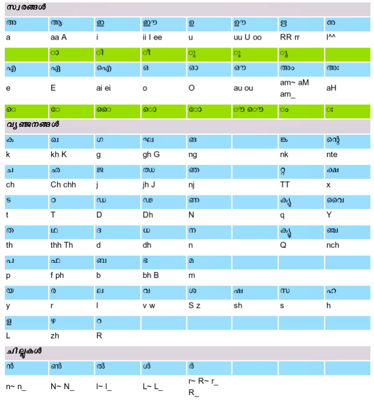

# Swanalekha (സ്വനലേഖ)

It is a Malayalam Editor for Windows 10. It uses the online Swanalekha script. Here is the keyboard help which you can use if you face any issues while typing.

The script was orignally written by [Santhosh Thottingal](http://thottingal.in/), thanks to him.
Developed by [Anuraj](http://dotnetthoughts.net).

Licensed under MIT.